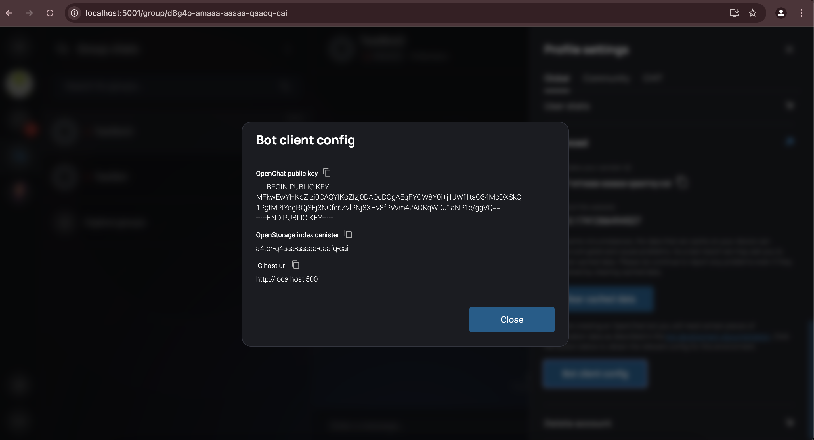
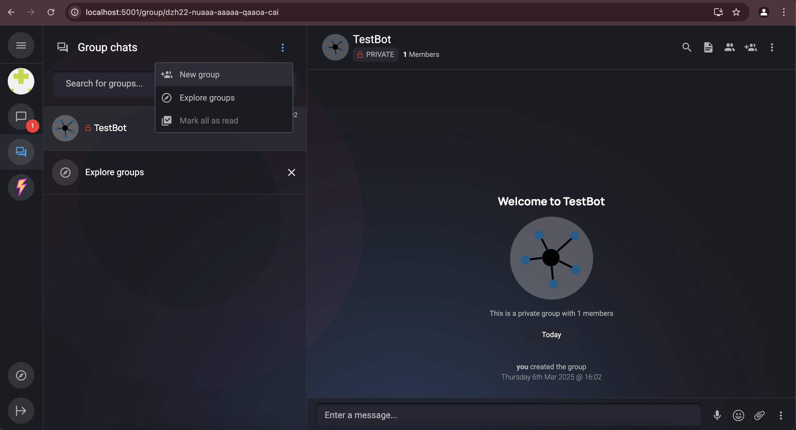
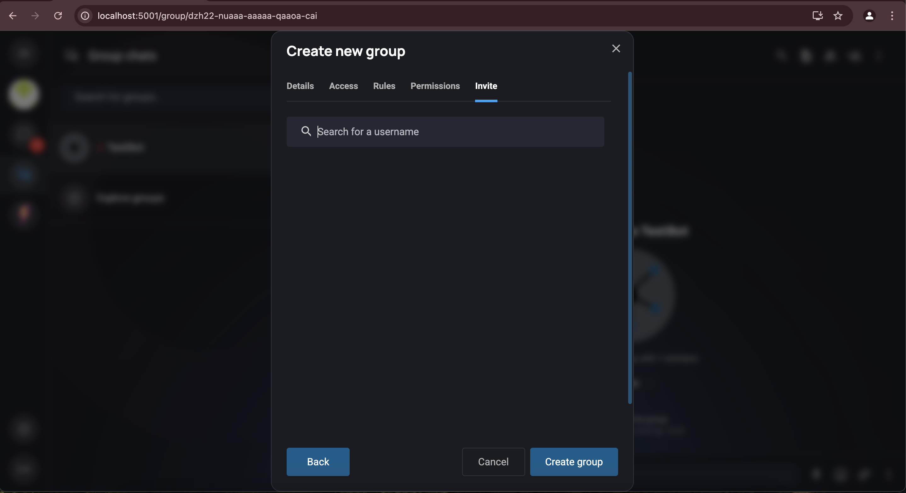
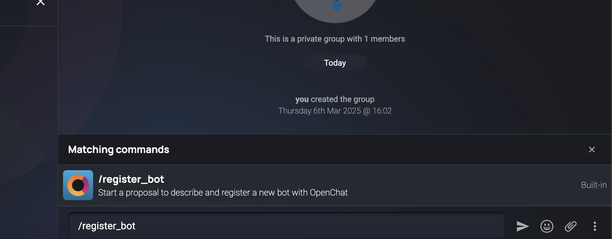
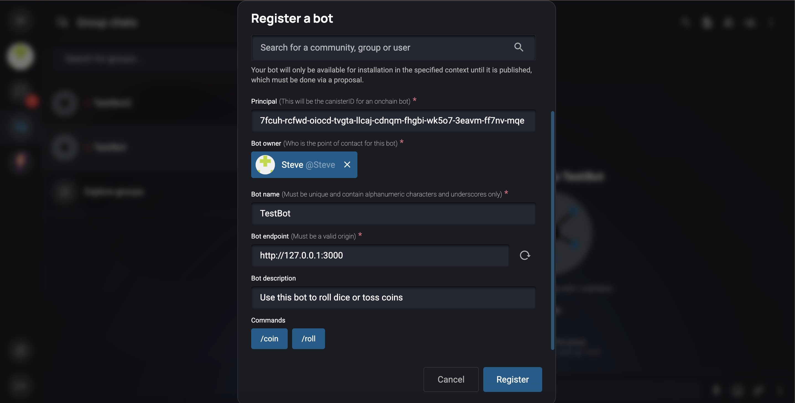
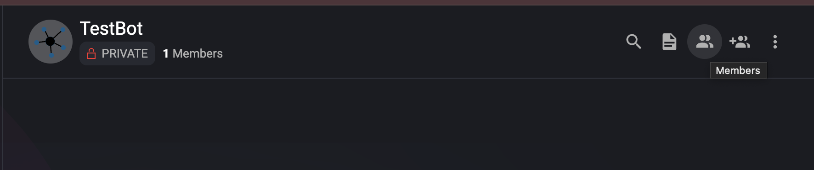
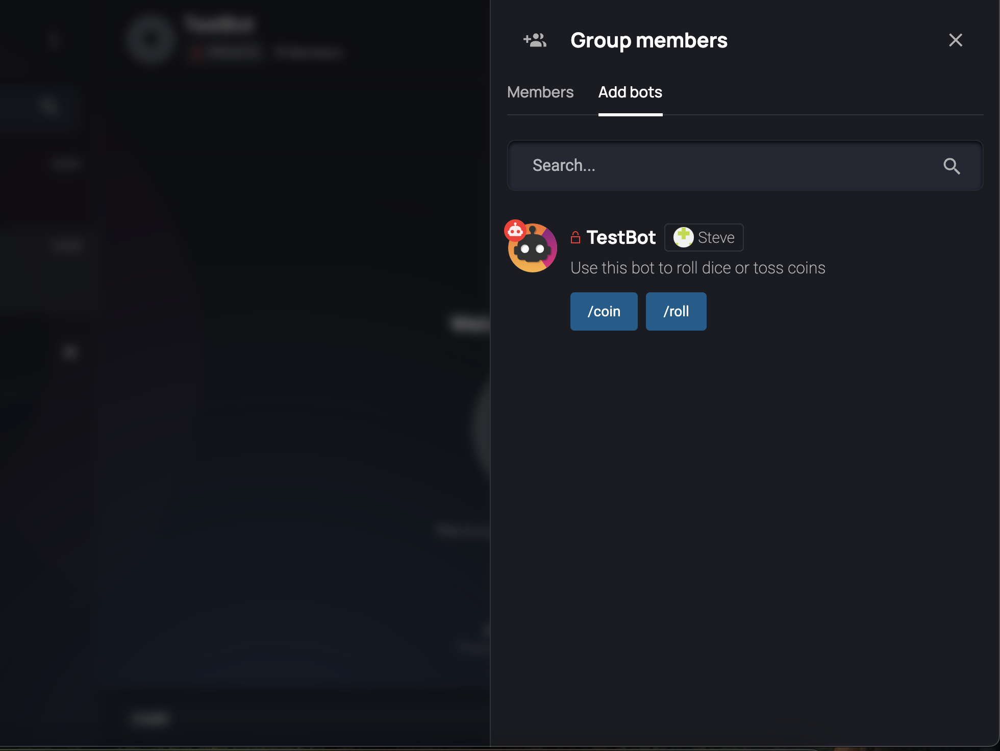
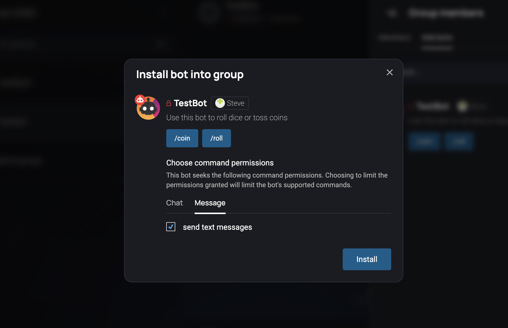
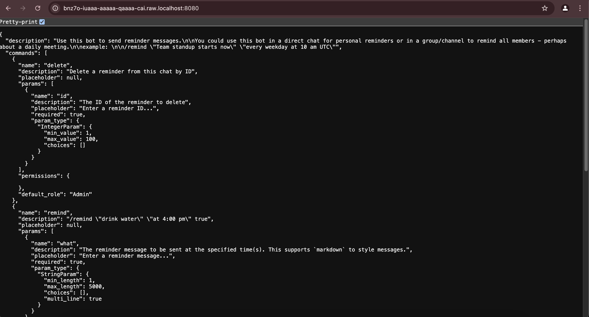
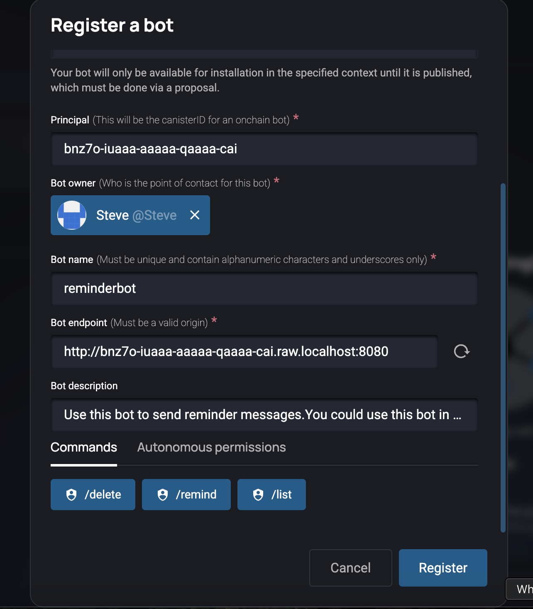

# Guide on creating an open chat bot

## Introduction
Open Chat is a decentralized messaging platform built on the Internet Computer blockchain. Open Chat bots allow developers to add automated functionality and interactive features to chats and communities.

There are two types of bots in Open Chat:
- **Offchain bots**: Run as external services that connect to Open Chat
- **Onchain bots**: Run directly on the Internet Computer as canisters

This guide will walk you through setting up both types of bots locally.

- Check out the official docs and sdk on open chat bots [here](https://github.com/open-chat-labs/open-chat-bots?tab=readme-ov-file#open-chat-bots)

- Once you have an understanding of the bots. You can now proceed to run open chat locally which is the first step 

## Running open chat locally: 

N/B: Ensure you're using ``node >= 20.0.0`` and ``dfx >= dfx 0.25.1-beta.0`` 

1. Clone the main open chat repo: 
```bash
git clone https://github.com/open-chat-labs/open-chat 

cd open-chat
``` 

2. Start dfx and install necessary canisters (Open chat and NNS): 
```bash 
dfx start --clean --background 

./scripts/deploy-local.sh
``` 

3. Once the script executes succesfully, run the frontend: 
```bash 
cd frontend 

npm run dev 
``` 

You can now open the frontend in your browser by navigating to ``http://localhost:5001``


## Section 1: Creating an offchain bot: 

### Now the next step is to check out the open chat bots repository:

1. Clone the open chat bot repository: 
```bash 
git clone https://github.com/open-chat-labs/open-chat-bots
cd open-chat-bots
```

2. Move into any of the examples that are there. We'll run the ``dice`` example: 
```bash 
cd rs/offchain/examples/dice/
``` 

3. Create a new identity that you'll use for the bot
```bash 
dfx identity new testbot_identity --storage-mode=plaintext  # we're using plaintext mode to be able to see the seed phrase 
```

4. Export the identity to a ``.pem`` file: 
```bash 
dfx identity export testbot_identity
```

4. Get identity of the bot from the generated identity: 
```bash 
dfx --identity testbot_identity identity get-principal
```

5. Get your open chat public key from the locally running open chat: 
Go to ``profile settings`` in the ``advanced`` section and click on the bot client config button, you will see your ``Open Chat Public Key``: 


Now create a ``.env`` file in the ``dice`` examples directory  & add the config. This is how your ``.env`` file should look like: 
```bash 
PEM_FILE="/Users/la/open-chat-hackathon/open-chat-bots/rs/offchain/examples/dice/testbot_identity.pem"
OC_PUBLIC_KEY="-----BEGIN PUBLIC KEY-----\nMFkwEwYHKoZIzj0CAQYIKoZIzj0DAQcDQgAEqFYOW8Y0i+j1JWf1taO34MoDXSkQ\n1PgtMPIYogRQjSFj3NCfc6ZvlPNj8XHv8fPVvm42AOKqWDJ1aNP1e/ggVQ==\n-----END PUBLIC KEY-----\n"
PORT=4000
IC_URL="http://127.0.0.1:8080" # For those running dfx on port 8080 
```

You can now run the ``dice`` bot in the ``open chat bots`` directory: 

```bash 
cargo run -- --pem-file /Users/la/open-chat-hackathon/open-chat-bots/rs/offchain/examples/dice/testbot_identity.pem
```

Once your bot is running, you can go back to the locally running open chat app and start the process of adding your bot


### Registering the bot on open chat locally: 

1. Create a new group on your local open chat: 




Enter the group name and just click ``next`` untill you reach the ``Create Group`` button



Once you've created the group, you can now start the open chat bot registration: 

Write ``/register_bot`` command to register a bot



Input the details of the bot



You can print the principal id of the bot by running the command: 
```bash 
dfx --identity testbot_identity identity get-principal
```

For the ``Bot endpoint`` you'll choose the endpoint of your bot as from the ``dice`` bot ``main.rs`` file: 
```rust
let listener = tokio::net::TcpListener::bind("127.0.0.1:3000") // It's here 
        .await
        .unwrap();
```

Click on the reload button "red in color" and you will see the Bot description immediately populated as ``Use this bot to roll dice or toss coins`` and the commands 
``coin`` & ``run`` outputted 

Now click on ``register`` and your bot will be registered within open chat, but not in any groups or communities 

Since you're the owner of the group on your locally running open chat, you can add the bot by clicking on ``members`` and then ``Add Bots``. You will then see an ``install bot`` popup 







When someone clicks on the enter command - command and arguments are sent to the bot gateway, signed, and then Open Chat sends JWT through the bot, it reads the JWT, processes the command and posts its response to open chat

## Section 2: Creating an onchain bot: 

Ensure you have set up open chat locally as per the instructions in the [Go to Running Open Chat Locally](#running-open-chat-locally) section.

1. Move into the onchain bots directory in the ``open-chat-bots`` folder: 
```bash 
cd rs/canister/examples/reminder
```

2. Create the ``reminder`` bot canister: 
```bash 
dfx canister create reminder_bot --no-wallet
```

3. Now build the canister, and hard code the canister id: 
```bash
dfx build --check
```

4. When installing the reminder bot, it will take a single argument, which is the ``OC public key``: 
```bash
dfx canister call user_index public_key '(record { })' # run this command inside the open-chat directory

# the command above will output the OC public key, copy it and paste it into the command below: 
dfx canister install reminder_bot --mode reinstall --argument '(variant { Init = record { oc_public_key = "<OC_PUBLIC_KEY>" } })' # run this command inside the open-chat-bots directory (in the reminder example)
```

5. Now you can view the bot definition by accesiing it from the endpoint: 
```bash
http://<canister-id>.raw.localhost:8080

# You'll replace the <canister-id> with the canister id that was outputted when you run the command ``dfx canister create reminder_bot --no-wallet``
```

This is what you'll see when you open the URL in your browser: 



Now the next step will be registering the bot in Open Chat locally. 

Type ``/register_bot`` in the chat and the popup for registering the bot will appear. 



The principal of the bot is the canister id that was outputted when you ran the command ``dfx canister create reminder_bot --no-wallet``

Then the endpoint is the endpoint of the bot that you can see in the browser when you open the URL ``http://<canister-id>.raw.localhost:8080``

And basically that's it, you've registered your bot on open chat locally. 