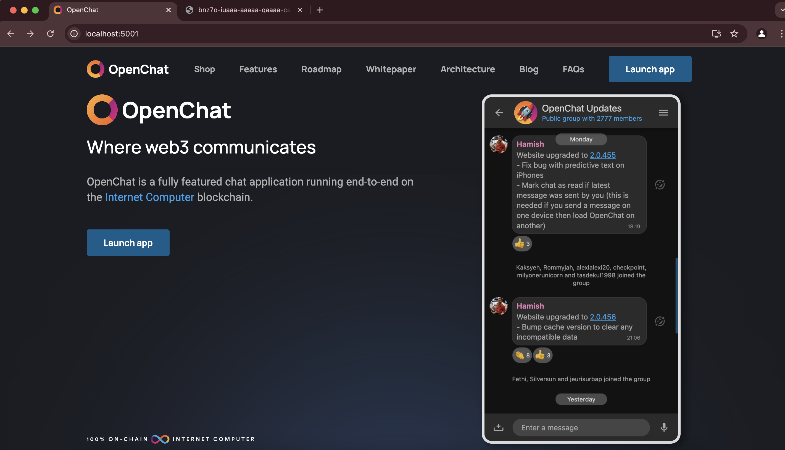
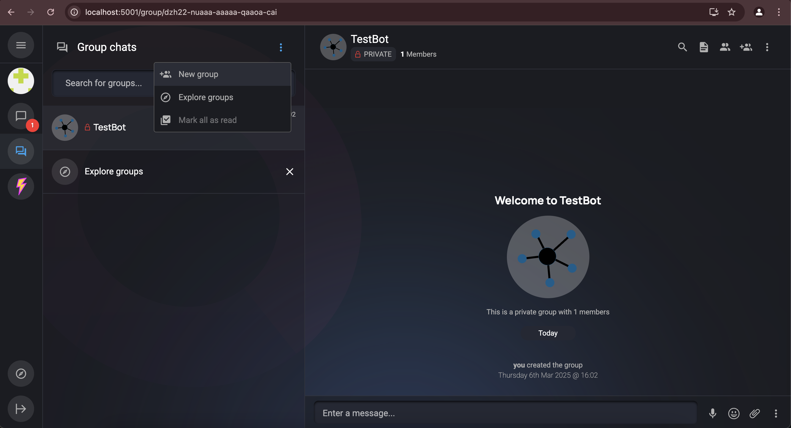
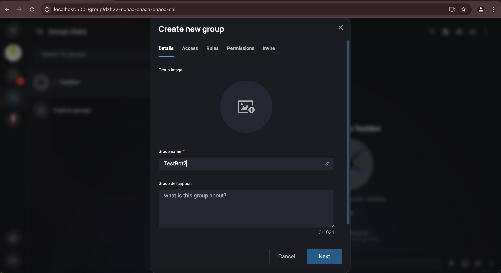
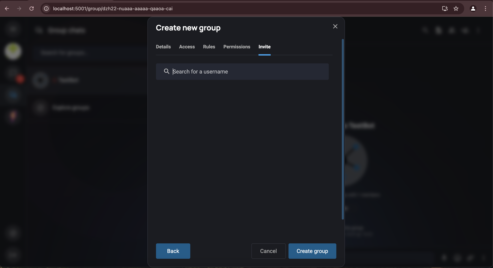
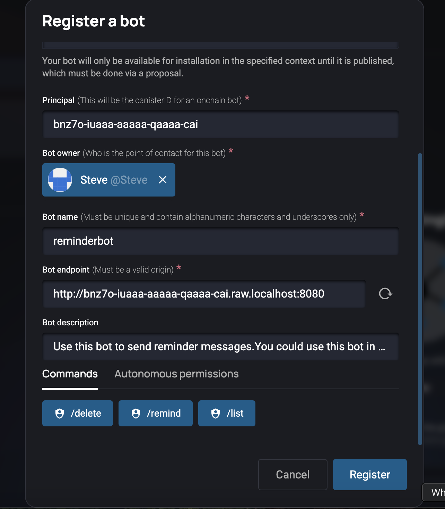
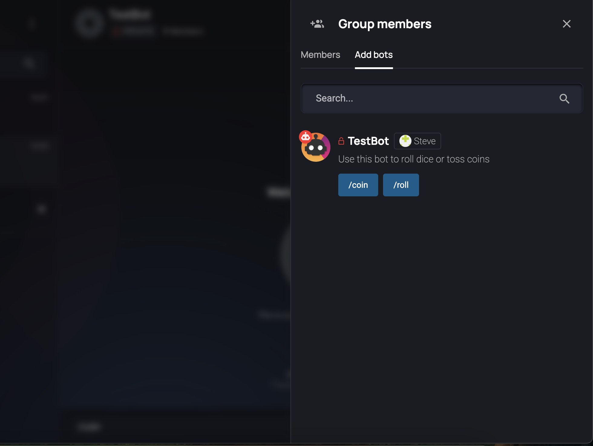
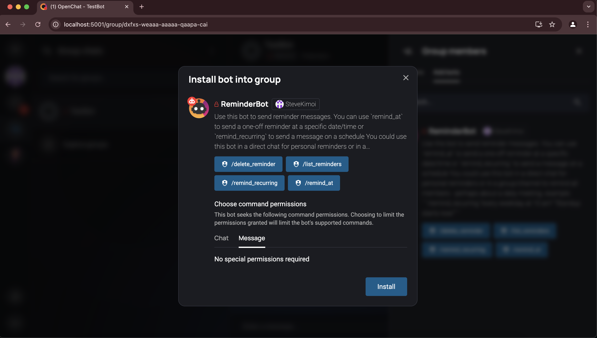

# Install and test the example bots

This is a guide to get the example bots up and running as a starting point for developing your own bot.

## Prerequisites

Ensure the `open-chat` and `open-chat-bots` repos are cloned into the same root directory:

```
open-chat-labs/
   |_open-chat
   |_open-chat-bots
```

## Step 1: Setup OpenChat Locally

1. Setup OpenChat locally by following the instructions in the [readme](https://github.com/open-chat-labs/open-chat/blob/master/README.md) of the OpenChat repo.

2. Run OpenChat in a browser with `http://localhost:5001/`

&nbsp;
After a minute or so you should see the OpenChat frontend.
&nbsp;



### Step 2: Create Account and Test Group

1. Signup and create an account

2. Create a private group for testing:

&nbsp;
Navigate to the groups section and then click "New group" from the groups menu
&nbsp;



&nbsp;
Enter the group name
&nbsp;



&nbsp;
Just pick default settings by clicking "next" until you reach the "Create Group" button
&nbsp;



### Step 3: Deploy the Bot

You can find scripts to deploy a selection of the example bots in the [scripts folder](./scripts/).

Note 1 - the LlamaBot can currently only be run on mainnet because it calls the DFINITY Llama canister.

Note 2 - the DiscordBot cannot be run locally because it needs to be reachable by Discord.

For offchain typescript bots, please refer to the [ts/readme](./ts/README.md).

### Step 4: Register the Bot

1. From your test group on the local OpenChat website enter `/register_bot` and fill in the fields

2. If registering a canister bot then for the `Principal` field use the bot canister id from the endpoint URL

3. This registers the bot on OpenChat for testing but it still needs to be installed into a group, community, or as a direct chat

&nbsp;



### Step 5: Add Bot to Group

1. Open the group members in the right panel

2. Look for the "Add bots" tab



3. Select the newly registered bot and install it



&nbsp;
You can now run the various bot commands it provides!
